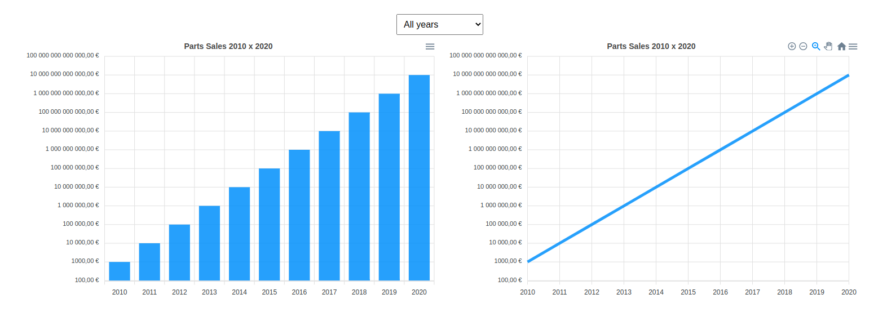

<h1 align="center">
  💻 Desafio - (Vue.js + Chart.js)
</h1>

<h4 align="center"><a href="https://dashboard-mcoutinho-nx82xltvv-danielsoaress.vercel.app/">Clique para visitar o projeto</a></h4>

## 📚 Aplicação

Desafio prosposta:

Escondemos alguns dados de vendas no nosso website público e desafiamos-te a fazer uma mini app que mostre a evolução de vendas (dica: talvez começar pelos elementos com o attribute data-year seja boa ideia)!

O que é esperado:

- Encontrar e processar os dados de vendas;
- Mostrá-los num frontend com um gráfico à tua escolha e com uma opção que permita mostrar/ocultar os anos ímpares.

---

## 💼 Tecnologias utilizadas

Para o desenvolvimento deste site utilizei as seguintes tecnologias:

- HTML;
- CSS;
- Javascript;
- Vue.js 2;
- Chart.js;

---

<h2>Autor</h2>

<table>
  <tr>
    <td align="center">
      <a href="https://github.com/daniel-soaress">
         
        
          <b>Daniel Soares</b>
        
      </a>
    </td>
  </tr>
</table>
